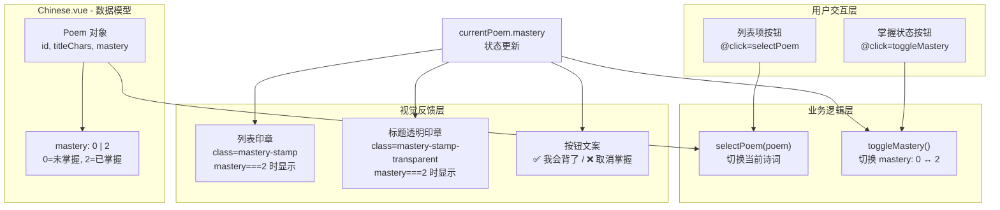

## 1. 高层摘要 (TL;DR)

- **影响范围:** 🟡 中等 - 为中文诗词学习界面新增"掌握状态"管理功能
- **核心改动:**
  - ✨ 新增诗词掌握状态标记系统（0=未掌握，2=已掌握）
  - 🎨 在列表和详情页添加"已掌握"印章视觉反馈
  - 🔘 添加"我会背了"/"取消掌握"切换按钮
  - 📐 优化标题区域布局，支持印章叠加显示

---

## 2. 可视化概览 (代码逻辑图)



---

## 3. 详细变更分析

### 📊 数据模型变更

| 属性 | 类型 | 说明 | 默认值 |
|------|------|------|--------|
| `mastery` | `number` | 诗词掌握状态：0=未掌握，2=已掌握 | `0` |

**变更位置:** `src/views/subjects/Chinese.vue` (第296、319行)

---

### 🎯 核心功能组件

#### **1. 列表项增强**
- **变更内容:** 在诗词列表项中添加"已掌握"印章显示
- **技术细节:**
  - 新增 `mastery-stamp` 样式类，红色渐变背景，-5度旋转
  - 条件渲染：`v-if="poem.mastery === 2"` 时显示印章
  - 调整标题区域布局，使用 `relative` 定位支持印章绝对定位
  - 优化按钮样式：添加 `min-h-[60px]` 确保高度一致
- **代码位置:** 第44-47行

#### **2. 标题区域重构**
- **变更内容:** 重构标题显示结构，支持右上角透明印章
- **技术细节:**
  - 使用 `inline-flex` 替代 `flex-wrap`，优化布局
  - 新增 `mastery-stamp-transparent` 样式类，半透明红色边框，+20度旋转
  - 印章位置：`absolute top-2 right-[-25px] z-10`
  - 保留拼音和汉字的逐字高亮逻辑
- **代码位置:** 第72-104行

#### **3. 掌握状态切换逻辑**
- **新增函数:** `toggleMastery()`
- **功能说明:** 在未掌握(0)和已掌握(2)之间切换状态
- **代码位置:** 第357-361行

```typescript
// 切换掌握状态
const toggleMastery = () => {
  if (!currentPoem.value) return
  currentPoem.value.mastery = currentPoem.value.mastery === 2 ? 0 : 2
}
```

#### **4. 操作按钮更新**
- **变更内容:** "我会背了"按钮添加点击事件和动态文案
- **技术细节:**
  - 添加 `@click="toggleMastery"` 事件绑定
  - 根据 `currentPoem.mastery === 2` 切换文案：
    - 已掌握：`❌ 取消掌握`
    - 未掌握：`✅ 我会背了`
- **代码位置:** 第223-226行

---

### 🎨 样式新增

| 样式类名 | 用途 | 视觉特征 |
|----------|------|----------|
| `.mastery-stamp` | 列表项印章 | 红色渐变背景，白色文字，-5°旋转，圆角12px |
| `.mastery-stamp-transparent` | 标题区域印章 | 半透明红色边框，+20°旋转，圆角14px，文字阴影 |

**代码位置:** 第574-596行

---

## 4. 影响与风险评估

### ✅ 无破坏性变更
- 新增功能不影响现有功能
- 向后兼容：旧数据默认 `mastery=0`，正常显示

### ⚠️ 潜在风险
1. **数据持久化缺失** - 当前状态仅在内存中切换，刷新页面后丢失
   - 建议：后续需接入后端API或本地存储保存掌握状态
   
2. **状态值硬编码** - 使用 `0` 和 `2` 作为状态值，语义不够清晰
   - 建议：定义常量 `const MASTERY_LEVEL = { NOT_MASTERED: 0, MASTERED: 2 }`

### 🧪 测试建议
- [ ] 点击"我会背了"按钮，验证列表和标题印章同时显示
- [ ] 点击"取消掌握"按钮，验证印章消失
- [ ] 切换不同诗词，验证掌握状态独立保存
- [ ] 验证印章在不同屏幕尺寸下的布局正常
- [ ] 验证印章不会遮挡标题文字或拼音

---